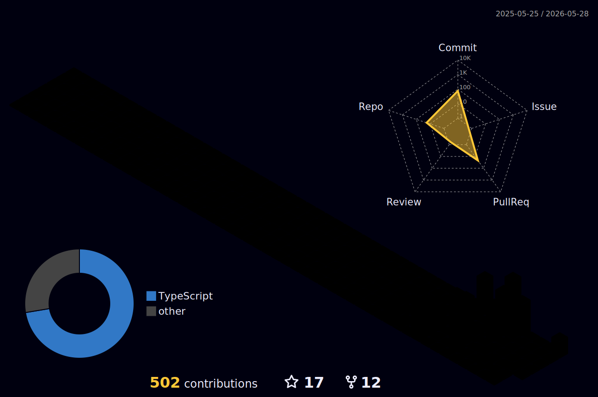

# Hernán Bonavota

### Software Developer · System Integrations · APIs · High-traffic web platforms

---

## 👋 Sobre mí

Soy desarrollador Full Stack especializado en **integración de sistemas, APIs y plataformas web complejas**.

Trabajo desarrollando y manteniendo **soluciones transaccionales de alto tráfico**, gestionando directamente clientes como **clubs de LaLiga**, conectando múltiples sistemas: plataformas de ticketing, servicios de pago, bases de datos, DataLake y APIs externas, en entornos donde se requieren sistemas robustos, seguros y altamente integrados.

Gran parte de mi trabajo consiste en **traducir lógica de negocio compleja en software fiable, mantenible y escalable**.

---

  
<strong>⚙️ Qué hago</strong>

   

Diseño y desarrollo soluciones que conectan distintos sistemas dentro de un mismo flujo operativo:

- APIs externas
- sistemas de ticketing
- DataLake
- pasarelas de pago
- bases de datos
- sistemas legacy

Trabajo especialmente en:

- integraciones complejas
- sincronización entre sistemas
- validaciones de negocio
- automatización de procesos
- mantenimiento evolutivo sobre entornos productivos
- resolución de incidencias en sistemas en producción

---

<strong>🏟 Experiencia en plataformas transaccionales</strong>

 

He trabajado en plataformas de alto tráfico orientadas a operaciones críticas como:

- venta de entradas
- renovaciones
- altas de abonados
- validación de usuarios
- generación de operaciones transaccionales
- integración de pagos

### Retos técnicos habituales

- concurrencia de usuarios
- control de disponibilidad en tiempo real
- consistencia de datos entre sistemas
- sincronización con APIs externas
- validación de operaciones críticas

---

<strong>🏗 System Design</strong>

 

Experiencia diseñando y manteniendo sistemas conectados que operan en producción real.

Incluye:

- Integración de APIs y sistemas externos
- Modelado de datos y consultas SQL optimizadas
- Consistencia de datos entre servicios
- Sistemas transaccionales
- Manejo de concurrencia
- Resolución de incidencias en producción

---

<strong>📈 Experiencia transversal: negocio, finanzas y comunicación</strong>

 

Antes de dedicarme al desarrollo de software trabajé durante más de **10 años en áreas comerciales y financieras**, incluyendo funciones de **controller financiero**.

Esta experiencia me permite entender con claridad la relación entre tecnología y negocio.

### Experiencia complementaria

- comprensión profunda de negocio y operaciones
- análisis de mercados financieros y criptoactivos
- lectura de gráficos y velas japonesas
- gestión de riesgo y dinámicas de mercado
- comunicación entre perfiles técnicos y de negocio
- liderazgo y evaluación de talento
- negociación y toma de decisiones

He realizado **más de 500 entrevistas profesionales**, colaborando con equipos multidisciplinarios y procesos de selección.

También cuento con formación en **Programación Neurolingüística (PNL)**:

- Practitioner
- Trainer
- Master

con foco en comunicación, liderazgo y comprensión del comportamiento humano.

---

## 🛠 Stack Tecnológico

### Lenguajes

-111?style=for-the-badge&logo=python)

### Frameworks & Runtime

### Web Fundamentals

### Bases de datos

### Infraestructura

### Testing

---

## 📚 Actualmente explorando

- Inteligencia Artificial aplicada a verificación de contenido
- Ciberseguridad
- Arquitecturas backend escalables

---
## 📊 GitHub Stats

---

## 📈 Activity Graph

---

## 🐍 Contribution Snake

  <picture>
    <source media="(prefers-color-scheme: dark)" srcset="./assets/github-snake-dark.svg" />
    <source media="(prefers-color-scheme: light)" srcset="./assets/github-snake.svg" />
    
  </picture>

---

## 🧊 Contribuciones en 3D

  

---

## 🌐 Conecta conmigo

