# Hernán Bonavota

### Full Stack Developer · Integración de sistemas · APIs · Plataformas web complejas

---

## 👋 Sobre mí

Soy desarrollador Full Stack especializado en **integración de sistemas, APIs y plataformas web complejas**.

Trabajo desarrollando soluciones tecnológicas para **organizaciones deportivas profesionales**, gestionando directamente clientes como **clubs de LaLiga**, en entornos donde se requieren sistemas robustos, seguros y altamente integrados.

Gran parte de mi trabajo consiste en **traducir lógica de negocio compleja en software fiable, mantenible y escalable**.

---

  
<strong>⚙️ Qué hago</strong>

   

Diseño y desarrollo plataformas web que conectan múltiples sistemas:

- APIs externas
- sistemas de ticketing
- DataLake
- pasarelas de pago
- bases de datos
- sistemas legacy

Me enfoco especialmente en:

- integraciones complejas
- automatización de procesos
- validaciones de negocio
- sincronización entre sistemas
- experiencias web orientadas a producción real

---

  
<strong>🏟 Sistemas de ticketing deportivo</strong>

   

He desarrollado y mantenido plataformas para venta de entradas y gestión de abonados en entornos de alto tráfico.

### Funcionalidades desarrolladas

- mapas de asientos SVG interactivos
- selección dinámica de butacas
- control de disponibilidad en tiempo real
- integración con APIs de ticketing
- validación de socios y abonados
- generación y verificación de entradas
- integración con pasarelas de pago
- automatización de flujos de compra

### Retos técnicos abordados

- concurrencia de usuarios
- control de inventario de asientos
- sincronización con APIs externas
- validaciones complejas de negocio
- consistencia de datos entre sistemas

---

  
<strong>🧠 Integraciones con DataLake</strong>

   

He desarrollado integraciones con **DataLake corporativos** para sincronización de información de socios y usuarios.

### Incluye

- consulta y validación de datos
- sincronización de perfiles
- actualización de datos personales
- validación de identidad
- gestión de sesiones y autenticación

Trabajo conectando plataformas web con APIs empresariales y flujos de datos estructurados entre múltiples sistemas internos.

---

  
<strong>📈 Conocimiento de mercados financieros</strong>

   

Tengo experiencia en análisis de mercados financieros y criptoactivos, incluyendo:

- análisis técnico
- lectura de gráficos y velas japonesas
- gestión de riesgo
- comprensión de dinámicas de mercado

Este conocimiento aporta contexto valioso para entornos **fintech**, donde entender el dominio financiero mejora la calidad de las soluciones tecnológicas.

---

  
<strong>🤝 Experiencia en negocio, liderazgo y comunicación</strong>

   

Antes de dedicarme al desarrollo de software trabajé durante más de **10 años en áreas comerciales y financieras**, incluyendo funciones de **controller financiero**.

### Experiencia transversal

- comprensión profunda de negocio y finanzas
- comunicación entre perfiles técnicos y de negocio
- liderazgo y evaluación de talento
- negociación y toma de decisiones

He realizado **más de 500 entrevistas profesionales**, colaborando con equipos multidisciplinarios y procesos de selección.

También cuento con formación en **Programación Neurolingüística (PNL)**:

- Practitioner
- Trainer
- Master

con foco en comunicación, liderazgo y comprensión del comportamiento humano.

---

## 🛠 Stack Tecnológico

### Lenguajes

-111?style=for-the-badge&logo=python)

### Frontend

### Backend

### Bases de datos

### Testing

### Infraestructura

---

## 📚 Actualmente explorando

- Inteligencia Artificial aplicada a verificación de contenido
- Ciberseguridad
- Arquitecturas backend escalables

---

## 📊 GitHub Stats

---

## 📊 GitHub Stats

---

## 🌐 Conecta conmigo

