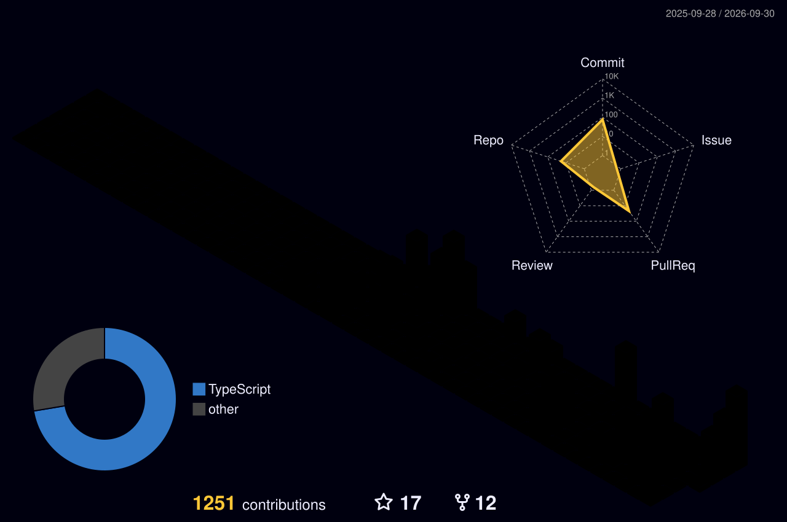

<h1 align="center">Hernán Bonavota</h1>

  

## About

Software engineer based in Palma de Mallorca. I run ticketing, member portals and payment flows for first-division football clubs in the LALIGA ecosystem, where concurrency and data consistency decide whether a sale goes through.

Recently I led the security audit and hardening of a ticketing and payments platform ahead of go-live: authorization, payment-state integrity and idempotency, session and 2FA handling, secrets, security headers and rate limiting.

I work spec-first. Every change starts as a written spec with acceptance criteria and its security and failure cases. Implementation is AI-assisted; the spec, the review and the verification are mine. You can see the process in the [specs of my portfolio repo](https://github.com/hbonavota/Portfolio/tree/main/docs/specs).

## Focus

- **Transactional platforms under load:** ticketing, access control, member validation, and integrating and operating external APIs in production.
- **Application security:** reviewing payment and access-control flows before they ship.
- **Currently studying:** offensive web security and LLM/RAG security.

## Stack

- **Languages:** TypeScript · C# · PHP · Python · SQL
- **Frameworks:** Node.js · Express · Next.js · React · WordPress/WooCommerce
- **Data:** MySQL · PostgreSQL · MongoDB
- **Infrastructure:** AWS (EC2, RDS, S3, ACM) · Nginx · Linux · GitHub Actions · Jenkins
- **Testing:** Jest · Cypress

## Background

10+ years in commercial and financial operations, including controller roles, before moving into software. That is where I learned to translate business constraints into technical decisions.

## Activity

  

  
  

  <picture>
    <source media="(prefers-color-scheme: dark)" srcset="./assets/github-snake-dark.svg" />
    <source media="(prefers-color-scheme: light)" srcset="./assets/github-snake.svg" />
    
  </picture>

## Links

[Portfolio](https://hbonavota.com) · [LinkedIn](https://www.linkedin.com/in/bonavota/)
